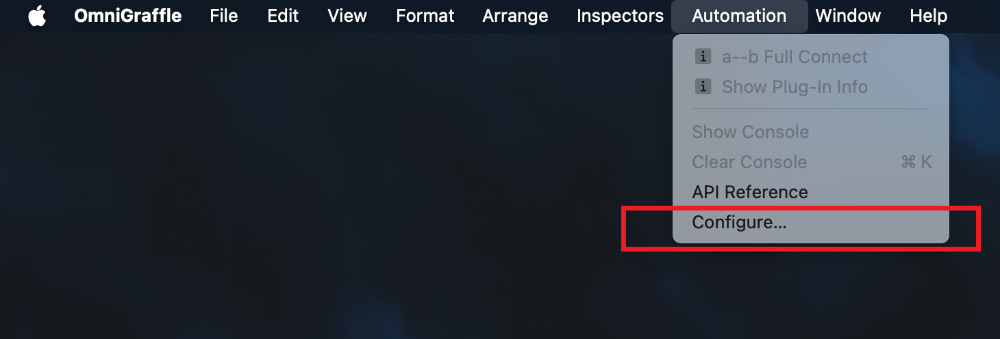
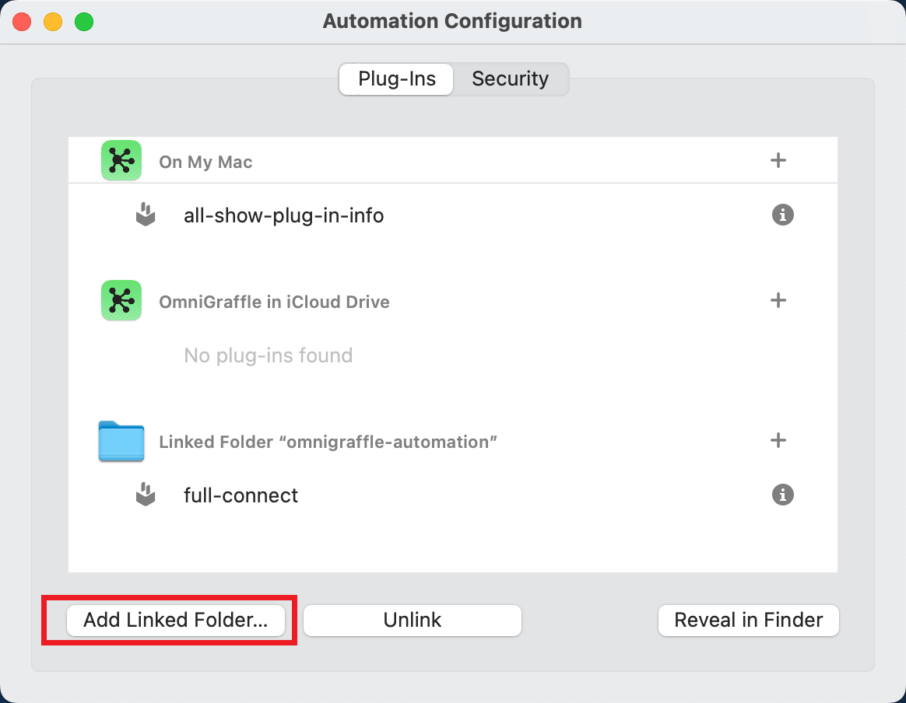

# omnigraffle-automation

<!-- vim-markdown-toc GFM -->

- [Usage](#usage)
- [Existing Tools List](#existing-tools-list)
  - [Full Connect](#full-connect)

<!-- vim-markdown-toc -->

This is my [Omnigraffle](https://www.omnigroup.com/omnigraffle) Automation Scripts.

Automation is a Pro feature of Omnigraffle, you have to buy the Pro version to use it.

Omnigraffle Automation allows you to use Javascript or AppleScript to customize actions.

You can create actions follow the [API Documentation](https://omni-automation.com/index.html).


## Usage

Clone this repository to your local disk first:

```bash
git clone git@github.com:laixintao/omnigraffle-automation.git
```

Then open Omnigraffle > Automation (only available in Pro version) > Configure...



Then add your omnigraffle-automation folder.



## Existing Tools List

### Full Connect

Create lines between 2 groups of objects by name (Cartesian product).


